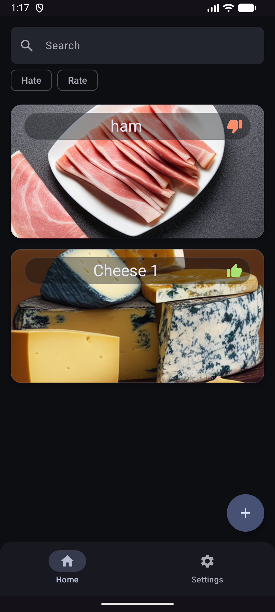
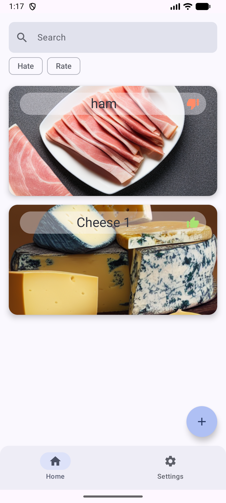
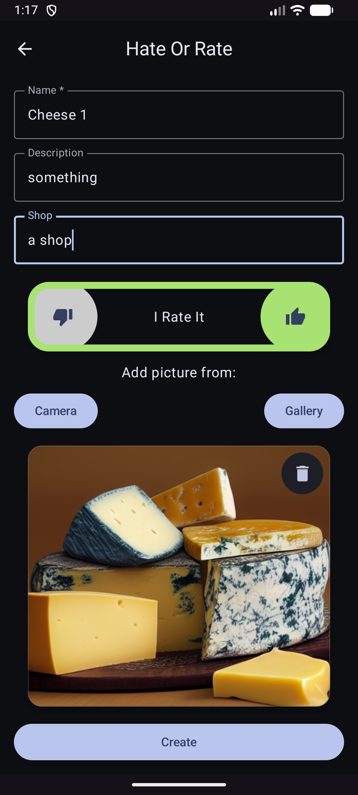
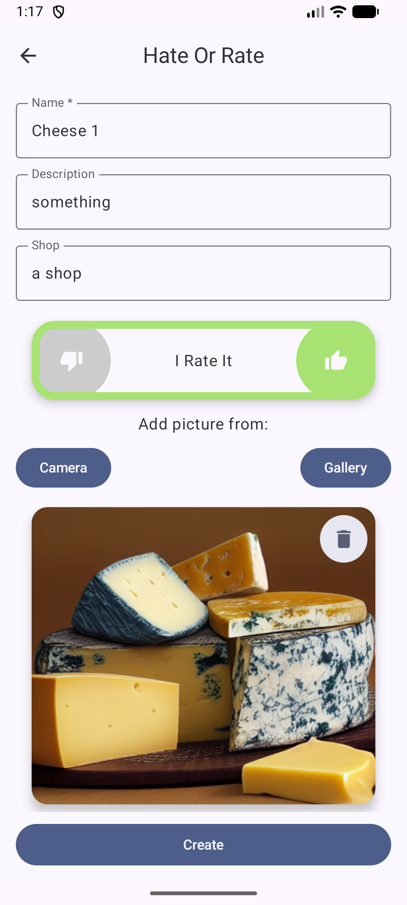
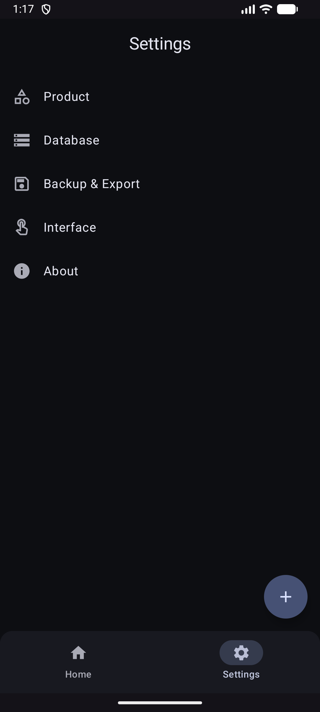
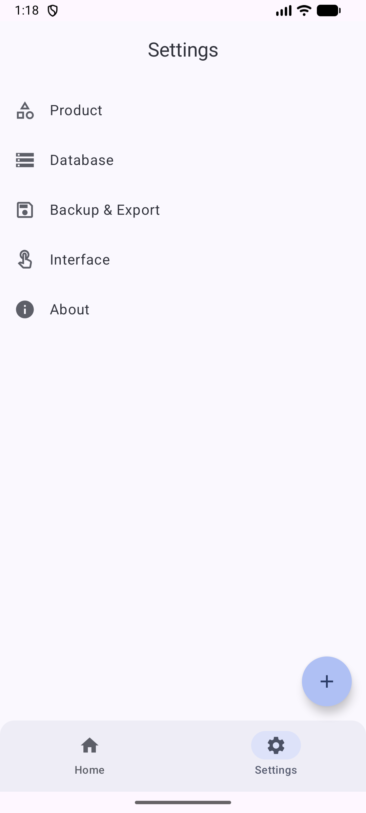
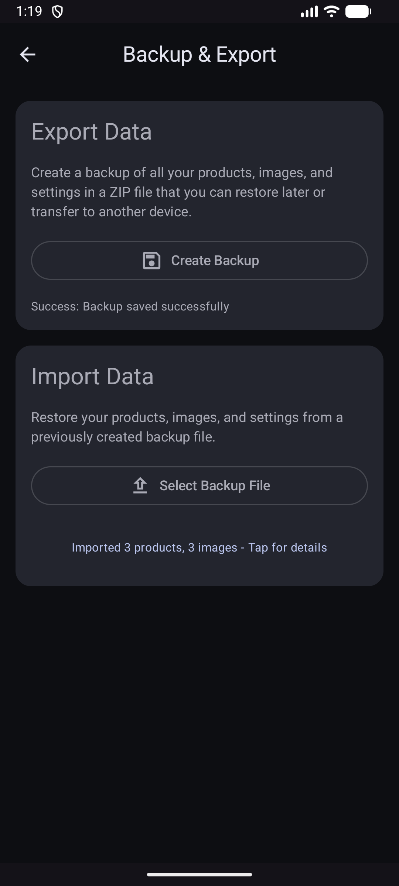
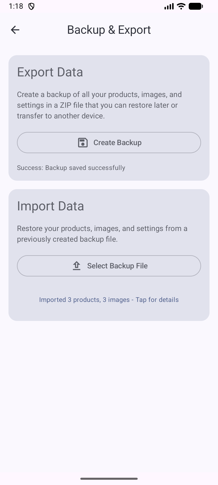

  

## HateItOrRateIt

This application offers a straightforward way to keep track of products you like
or dislike. It allows you to easily upload photos, names, descriptions, and store
information, enabling you to make informed decisions about future purchases.

[Project board](https://tasks.gregstuff.click/project/hateitorrateit/kanban)

Install
---------

## Why This App Can Be Helpful

There are times when you purchase a product that you either like or dislike, only to realize later that you can't remember its name. This is particularly true for items like cheese, ham, etc., where there are countless variations and it's challenging to keep up with all the names. This app aims to solve that problem, enabling you to recall the exact product the next time you need it.

<https://github.com/Grigoriym/HateItOrRateIt/assets/31949421/de24f8f3-ed42-4944-af75-548de1988259>

| Dark | Light |
|---|---|
|  |  |
|  |  |
|  |  |
|  |  |
